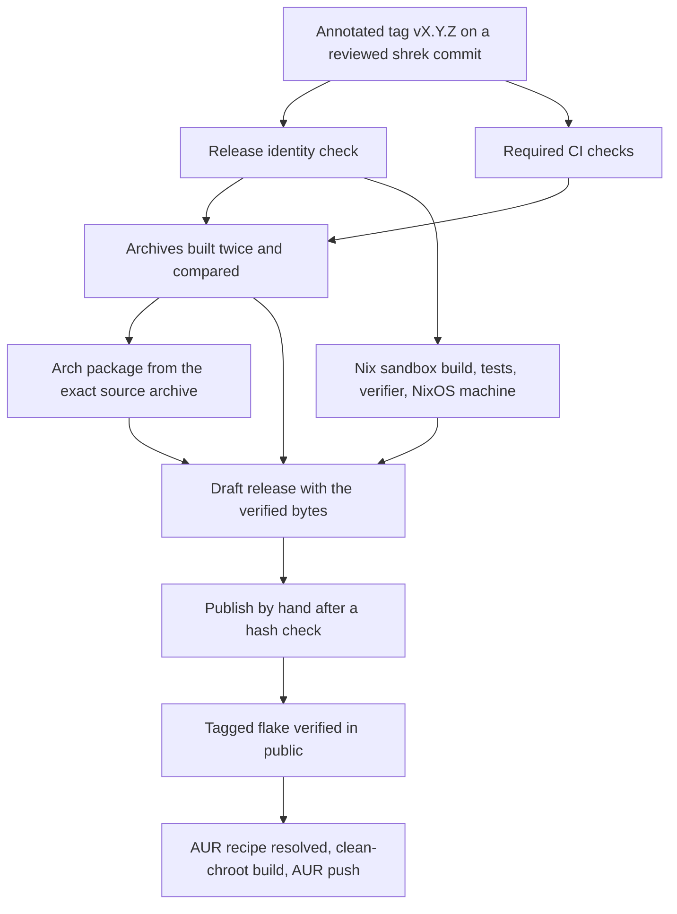

# Releasing xunhen

A release is one reviewed commit on `shrek`, named by an annotated tag,
built into reproducible archives, packaged for Nix and Arch, checked by the
same artifact verifier in every channel, and published without being built
again. This page is for maintainers.



## Release inputs

| Input | Where | Pinned by |
| --- | --- | --- |
| Source | the tagged commit | the annotated tag `vX.Y.Z` |
| Version | `VERSION` | must equal the tag without its `v` |
| Commit | the resolved tag | passed to the build with `-X main.commit`, never stored in a file |
| Go toolchain | `go.mod`, `mise.toml`, CI | exact version; `GOTOOLCHAIN=local` refuses any other |
| Go modules | `go.sum` | checksums; the release refuses `replace` directives and vendoring |
| Third-party notices | `THIRD_PARTY_NOTICES.txt` | generated from the modules linked into the executable |
| Nix inputs | `flake.lock`, `vendorHash` in `nix/package.nix` | nixpkgs revision and the vendored modules' hash |
| Arch recipe | `packaging/aur/PKGBUILD.in` | resolved after the tag exists |

What each build reports as its identity:

| Build | `xunhen version` shows |
| --- | --- |
| Release archive | the tag and its full commit |
| Snapshot archive, built without `-tag` | `vX.Y.Z-snapshot.gCOMMIT` and the commit, so it cannot pass for a release |
| Nix, from a tag or clean checkout | `VERSION` and the flake's revision |
| Nix, from a dirty tree | `VERSION` with `-dirty`, and the dirty revision or `unknown` |
| Arch package | the version and commit written into the recipe |
| `go install ...@vX.Y.Z` | the module version and `commit: unknown` |
| Local `go build` in a clone | a pseudo-version such as `v0.0.0-20260927154418-65a2d2281456` and the commit; `+dirty` and `(modified)` mark uncommitted changes |
| `go build` without git metadata | `devel` and `commit: unknown` |

## Before tagging

1. **Toolchain.** Check <https://go.dev/dl/> for a newer patch release of the
   Go line in `go.mod`. If there is one, update `go.mod`, `mise.toml`, and
   the CI setup together, run every check, and check that the pinned
   nixpkgs has a builder for it (see [Updating the Nix inputs](#updating-the-nix-inputs)).
2. **Version.** Set `VERSION` to the release version, such as `1.0.0` or
   `1.0.0-rc.1`, without a `v`.
3. **Changelog.** Rename `## [Unreleased]` in `CHANGELOG.md` to
   `## [1.0.0] - YYYY-MM-DD` and start a new empty `## [Unreleased]` above
   it. The release workflow copies this section into the release notes and
   fails without it.
4. **Notices.** `tools/release.sh notices -check` must pass. After a
   dependency change, run `tools/release.sh notices` and review the new
   license texts.
5. **Nix.** After a `go.sum` change, update `vendorHash`; the CI Nix job
   fails when it is stale.
6. **Rehearse.** From a clean checkout of the commit to release:

   ```sh
   tools/reproduce.sh                       # two clean builds, compared byte for byte
   dir=.local/reproduce/$(git rev-parse HEAD)/first
   version=$(jq -r .version "$dir/provenance.json")
   go run ./tools/verify -archive "$dir/xunhen_${version}_linux_amd64.tar.gz" \
     -sums "$dir/SHA256SUMS.txt" -version "v$version" -commit "$(git rev-parse HEAD)" -go go1.27.1
   ```

   Also run the longer fuzz campaign and the measurements that
   [verification.md](verification.md) describes.
7. Merge the release commit to `shrek` and let CI pass on it.

## Tagging and the release workflow

```sh
git tag -a v1.0.0 -m "xunhen 1.0.0"
git push origin v1.0.0
```

Never move or delete a pushed tag. A mistake gets a new version.

The tag starts `.github/workflows/release.yml`:

| Job | What it checks or produces | Permissions |
| --- | --- | --- |
| Required checks | the whole CI workflow, run on the tagged commit | read |
| Release identity | `tools/release-identity.sh`: the tag is annotated, names the built commit, matches `VERSION`, is on `shrek`, and has a changelog section | read |
| Release archives | `tools/reproduce.sh -tag`: two builds from fresh clones at different paths, compared byte for byte, then `tools/verify` on the archive | read |
| Nix package | `nix flake check`: the sandboxed build and test suite, `tools/verify` on the packaged executable, and a NixOS machine that installs xunhen through `environment.systemPackages` | read |
| Arch package | the recipe resolved against the exact source archive, linted with `namcap`, built with devtools in a clean chroot (its `check()` runs the tests and `tools/verify`), installed and verified again, upgraded, downgraded, and removed | read |
| Stage | rechecks every hash, reads the release notes, creates a **draft** release with the four assets, downloads them again, and compares | write |

Each job keeps its logs as a workflow artifact: the reproduction and
verification logs, `nix flake check` output and the package's hash and
closure, and the Arch build log, `namcap` reports, and package.

The Arch job runs devtools in a privileged container that shares the
runner's cgroups, process namespace, and system bus, which
`systemd-nspawn` needs. That is fine on a disposable CI runner and a bad
idea on a workstation: on your own Arch machine, install `devtools` and run
`extra-x86_64-build` directly instead.

### Rehearsing

Run **Release** by hand from `shrek` (Actions, Release, Run workflow) to
rehearse every job on the current commit without a tag. The archives get
the snapshot version `VERSION-snapshot.gCOMMIT`, and staging creates a draft
named `rehearsal-COMMIT`. GitHub creates a draft's tag only when the draft
is published, so a rehearsal adds no tag. Then run **Publish release** with
that name and `rehearsal` set: it runs every publishing check against the
draft and deletes it instead of publishing.

### Publishing

Staging leaves a draft. Look at it, then run **Publish release**
(`.github/workflows/publish.yml`) by hand with the tag as `release`. It downloads the
draft's assets, checks them against `SHA256SUMS.txt` and `provenance.json`
and the tag's commit, then compares all four, byte for byte, with the
`archive` artifact of the successful **Release** run for that tag and
commit. Only then does it publish the draft. It never builds anything, so
the published bytes are the verified ones.

The comparison with the run's artifact matters because a draft's assets
can be edited: someone could replace an archive along with
`SHA256SUMS.txt` and `provenance.json`, and the draft would still agree
with itself. The artifact cannot be changed after the run. Workflow
artifacts expire after the repository's retention period, 90 days by
default, so publish the draft before then.

Starting the workflow by hand is the approval, and only accounts with
write access to the repository can start it. Turn on immutable releases in
the repository settings: GitHub then refuses to change a published release's
assets or move its tag. Staging already follows the order that requires:
create the draft, attach every asset, then publish.

Only the stage and publish jobs can write to the repository, and neither
runs on pull requests or executes repository code. Pull requests run only
`ci.yml`, with read access.

### What the checksums prove

`SHA256SUMS.txt` lets a user confirm a download is intact. It comes from the
same release page as the archives, so it does not prove who published them.
Reproducibility is the independent check: anyone can build the tag with
`tools/reproduce.sh -tag vX.Y.Z` and compare. Signing or GitHub artifact
attestations would add publisher authentication; if they are adopted, give
the extra permissions they need only to the stage job.

## Channel order

1. **Archives.** Publish the release, as above. The source archive is now
   public at a fixed URL.
2. **Nix.** From another machine, check the public tag:

   ```sh
   nix flake check -L github:nuggocto/xunhen/v1.0.0
   nix run github:nuggocto/xunhen/v1.0.0 -- --version
   ```

3. **AUR.** Resolve the recipe against the published source archive, build
   it in a clean chroot, and push it (next section).
4. **Website.** Update the landing page and changelog in `xunhen-front`
   only after the three channels work in public.

## The AUR package

`packaging/aur/PKGBUILD.in` is the maintained template. The published recipe
lives in the separate AUR repository `ssh://aur@aur.archlinux.org/xunhen.git`,
whose branch is `master`; it never enters this repository. The checksum of
the source archive is known only after the tag exists, so the template is
committed first and resolved afterwards. Do not move the application tag to
record its own archive's checksum.

On an Arch machine with `devtools` and `namcap`:

```sh
version=1.0.0
curl -fLO "https://github.com/nuggocto/xunhen/releases/download/v$version/SHA256SUMS.txt"
commit=$(git rev-parse "v$version^{commit}")
sha256=$(awk -v f="xunhen_${version}_source.tar.gz" '$2 == f {print $1}' SHA256SUMS.txt)
packaging/aur/resolve.sh -version "$version" -commit "$commit" -sha256 "$sha256" \
  -maintainer 'Your Name <you at example dot org>' -out ../aur-xunhen

cd ../aur-xunhen
namcap PKGBUILD
extra-x86_64-build             # devtools: builds, tests, and verifies in a clean chroot
namcap xunhen-*.pkg.tar.zst
git add PKGBUILD .SRCINFO
git commit -m "Update to $version"
git push
```

`resolve.sh` writes `PKGBUILD` and generates `.SRCINFO` with
`makepkg --printsrcinfo`; regenerate both whenever the recipe changes. For a
packaging-only fix, pass `-pkgrel 2` and so on, and leave the application
version alone. Before a public tag exists, rehearse with a local source
archive from `tools/release.sh build -tag`, passed as `-source`, placed next to
the resolved `PKGBUILD`.

`namcap` reports three warnings on the package: no PIE, no full RELRO, and
an unstripped executable. The template explains all three; keep the
static, cgo-free build unless the release archive changes it too. Any other
`namcap` finding needs a look.

Keep the AUR SSH key on the maintainer's machine. No workflow in this
repository holds AUR credentials, and none publishes to the AUR. A dedicated
key, registered in the AUR account settings, keeps AUR pushes apart from
other SSH use; point `~/.ssh/config` at it:

```text
Host aur.archlinux.org
    User aur
    IdentityFile ~/.ssh/aur_ed25519
    IdentitiesOnly yes
```

`ssh aur@aur.archlinux.org help` then answers without asking for a password,
and `git clone ssh://aur@aur.archlinux.org/xunhen.git` gives a clone you can
push the resolved recipe from. The first push to a name nobody owns creates
the package.

## Updating the Nix inputs

- **nixpkgs:** `nix flake update nixpkgs`, then `nix flake check -L`. The
  package names `buildGo127Module`; when `go.mod` moves to a new Go line,
  change it to the matching builder, and check its Go version satisfies the
  `go` directive with
  `nix eval --raw .#packages.x86_64-linux.xunhen.go.version`.
- **vendorHash:** after changing `go.sum`, set `vendorHash` to
  `lib.fakeHash`, run `nix build .#xunhen`, and copy the hash from the
  mismatch error into `nix/package.nix`.

## Remaining checks for a candidate

These run once a candidate tag exists, outside this workflow:

- `go install github.com/nuggocto/xunhen/cmd/xunhen@vX.Y.Z` from the public
  module proxy, and its `xunhen version` output.
- Fetching the published source archive through the AUR recipe, rather than
  a local copy.
- Installation on the Debian, Ubuntu, Alpine, NixOS, and Arch environments
  the release claims, with native or virtual-machine evidence for the
  oldest kernel it supports. Containers share the host's kernel, so a
  container run shows userland compatibility only.
